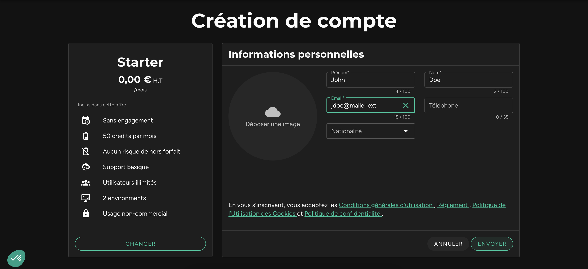
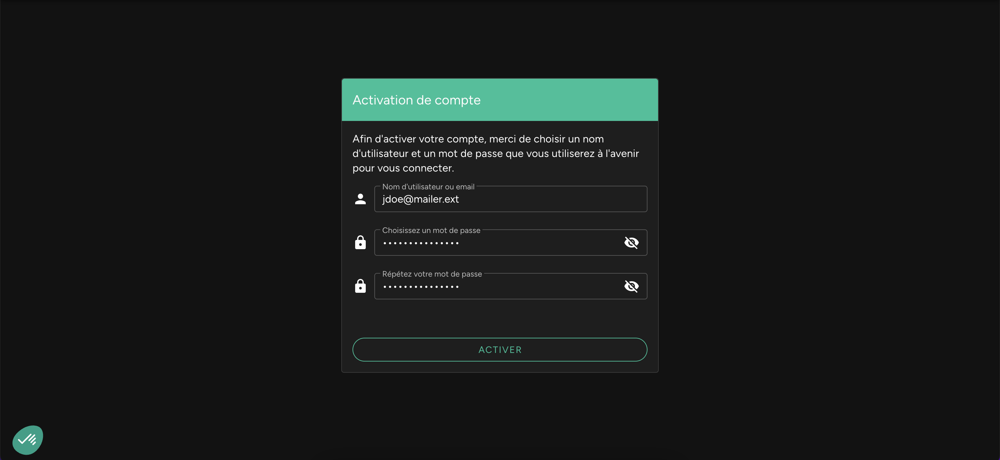

* **Inscription** : Rendez-vous sur [protocode.tech](https://protocode.tech/fr/registration/new-account), choisissez l'abonnement qui correspond le mieux à votre besoin, puis remplissez le formulaire en utilisant votre adresse e-mail professionnelle.  
    

* **Connexion** : Après vérification de votre e-mail, choisissez votre identifiant et votre mot de passe, puis accédez à votre espace de travail.  
  