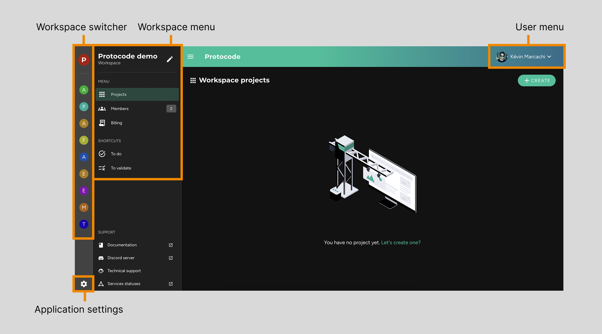

The Protocode interface offers simple and intuitive navigation, structured as follows:

* **A left sidebar** allows you to switch between different workspaces you belong to (_workspace switcher_) and access application settings (including language and display options).  
* **A left navigation menu** contains elements to navigate within the selected workspace (allowing you to manage projects, members, and anything related to billing).  
* **A user menu**, located in the top-right corner, displays options to update personal information, connection settings, or log out.  

