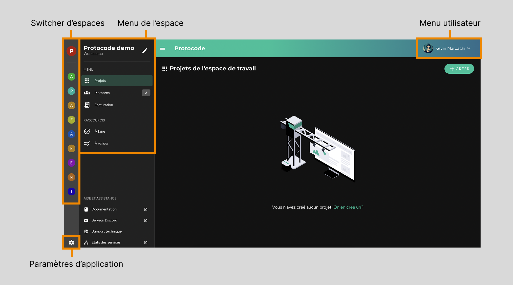

L'interface de Protocode propose une navigation simple et intuitive, se découpant ainsi :  

* **Une barre latérale gauche** vous permet de naviguer entre les différents espaces de travail auxquels vous appartenez (_switcher d'espaces_), ainsi que d'accéder aux paramètres de l'application (notamment les options de langue et d'affichage).  
* **Un menu latéral gauche** contient les éléments de navigation à l'intérieur de l'espace sélectionné (permettant notamment de gérer les projets, les membres et tout ce qui est lié à la facturation).  
* **Un menu utilisateur**, situé dans la partie supérieure droite, affiche les options permettant de mettre à jour les informations personnelles, les paramètres de connexion ou encore de se déconnecter.  

  
