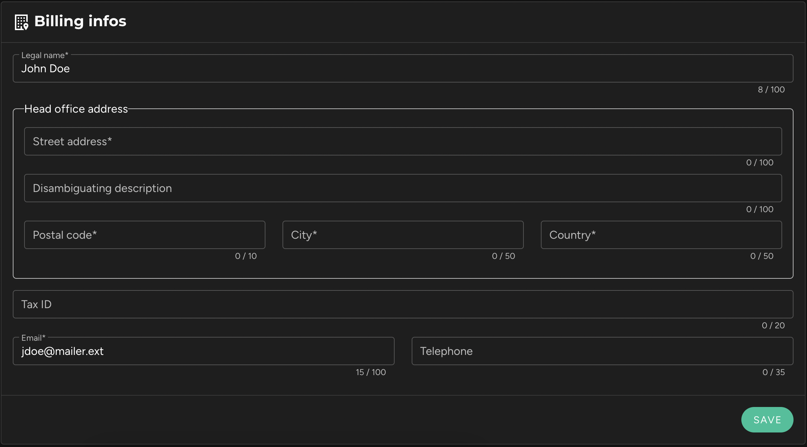

Administrators of the workspace can see a **"Billing"** button in the left sidebar. This link opens a page where you can view and modify all the billing details.

### 1. **Subscription**
The first block shows the details of the subscribed plan. A context menu in the top right of the block also allows you to modify the chosen plan or cancel the current subscription.

### 2. **Current Consumption**
The second block allows you to check the current consumption of credits for the ongoing billing period and the estimated amount for the next invoice.

### 3. **Invoices**
The third block lists all issued invoices, with the option to download each one as a PDF.

### 4. **Billing Information**
The fourth block contains a form where billing information (name, company name, billing address, SIREN number, etc.) can be entered.

### 5. **Payment Methods**
The final block lists the payment methods provided when subscribing to the current plan. If you are subscribed to our free "Starter" plan, no payment method is required.

