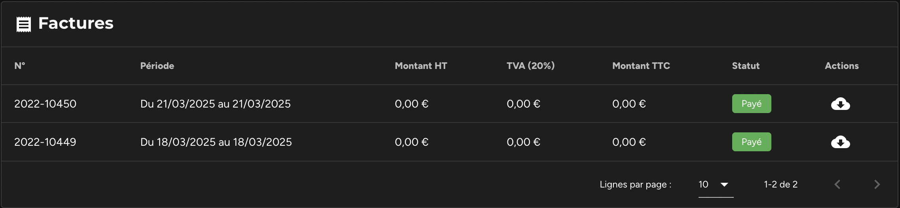
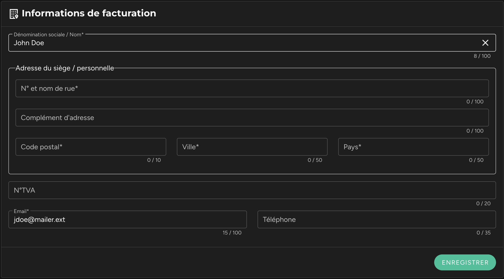
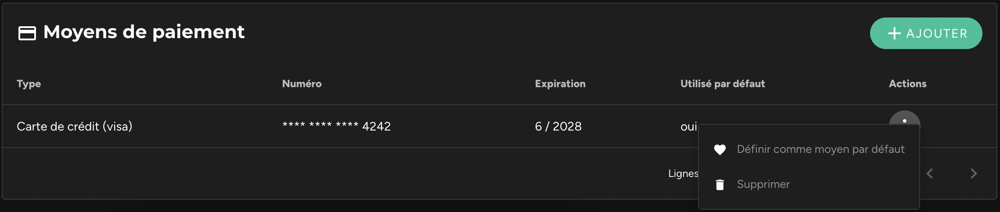

Les administrateurs de l'espace peuvent voir un bouton "Facturation" dans le menu latéral gauche. Ce lien ouvre une page dans laquelle vous pouvez consulter et modifier tous les détails de votre facturation.  

Un premier bloc "Abonnement" reprend les détails de l'abonnement souscrit. Un menu contextuel en haut à droite du bloc permet aussi de modifier la formule choisie, ou encore de résilier l'abonnement en cours.  

Un second bloc "Consommation en cours" permet de consulter l'état de la consommation des crédits sur la période de facturation en cours, et le montant prévisionnel de la prochaine facture.  

Un troisième bloc "Factures" liste l'ensemble des factures émises, et offre la possibilité sur chacune d'elles de télécharger la facture au format PDF.  

Un quatrième bloc "Informations de facturation" intègre un formulaire dans lequel sont saisies les informations reportées sur les factures (Nom, dénomination sociale, adresse de facturation ou encore numéro de SIREN).  

Un dernier bloc liste les moyens de paiement renseignés lors de la souscription de l'abonnement en cours. Si vous souscrivez à notre offre gratuite "Starter", aucun moyen de paiement n'est obligatoire.  

