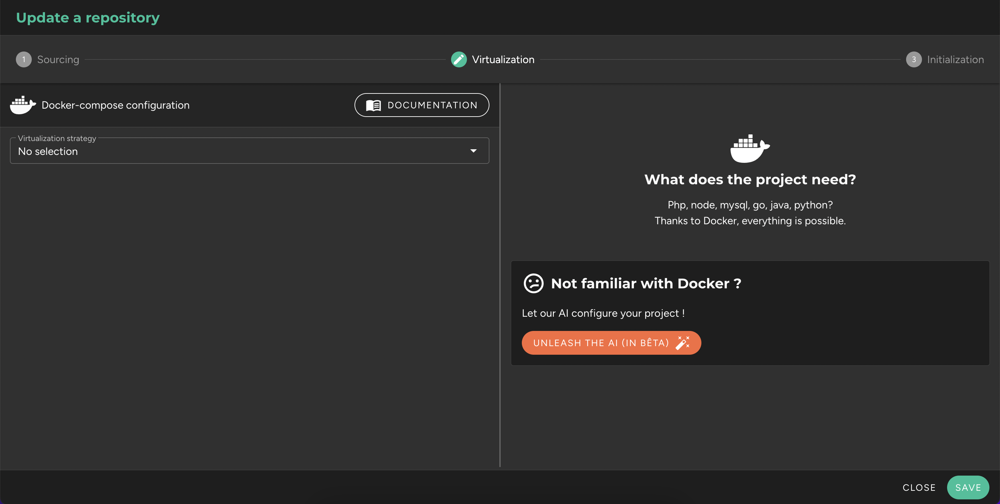

`FEATURE IN BETA`

Once a repository is added and read/write permissions are granted, you are redirected to the second tab, "Virtualization." The screen is divided into two sections. On the left, you can manage the Docker and Docker Compose configuration. On the right, options related to pre-building images will appear. If no virtualization strategy is selected, you are offered the option to launch the automated configuration by AI.

## Generation of Configuration Files

The AI will generate the necessary files to run the project in Protocode within the repository, in a `.protocode` folder:

This folder contains:
* A **docker-compose.yml** file that contains the Docker Compose configuration (for the main application, its database, and its preview URL).
* A **Dockerfile** that contains the instructions to build the main application image.
* A **.env** file that will contain all environment variables, including database passwords if any (randomly generated by the AI).
* A **lifecycle** folder containing initialization scripts, including those for installing dependencies.

## Creating a Branch in Your Repository

These files will be pushed to your repository in a "protocode" branch, which will temporarily become the default branch for the project in Protocode. You are free to merge the **protocode** branch with your typical default branch (usually _main_, _master_, or _develop_), then return to the "Sources" tab of the repository and reset the default branch.

## Updating Configuration in Protocode

The AI will also update the Protocode configuration to use the generated files.

## Automatic Launch of Prebuilding Processes and Caching

Finally, the AI will automatically launch the Docker image prebuild and caching processes. When the process is completed, a confirmation message "All set" will be displayed on the screen. You can click "Close" at the bottom right.
