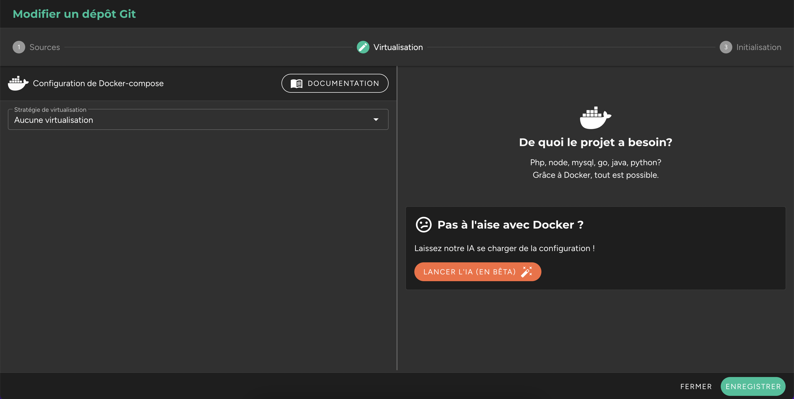

`FONCTIONNALITÉ EN BÊTA`

Une fois un dépôt ajouté et les droits en lecture et écriture accordés, vous êtes redirigé vers le deuxième onglet "Virtualisation". L'écran est scindé en deux parties. Une première à gauche permet de gérer le paramétrage de Docker et Docker Compose. À droite, apparaîtront des options relatives à la préconstruction des images. Dans la partie droite, si aucune stratégie de virtualisation n'est sélectionnée, il vous est proposé de lancer la configuration automatisée par IA.

## Génération des fichiers de configuration

L'IA générera les différents fichiers nécessaires pour exécuter le projet dans Protocode, au sein du dépôt, dans un dossier `.protocode` :

Ce dossier contient notamment :
* Un fichier **docker-compose.yml** qui contient le paramétrage de Docker Compose (pour l'application principale, sa base de données, son URL de prévisualisation).
* Un fichier **Dockerfile**, qui contient les instructions pour construire l'image de l'application principale.
* Un fichier **.env** qui contiendra toutes les variables d'environnement, notamment les mots de passe de base de données s'il y en a (générés aléatoirement par l'IA).
* Un dossier **lifecycle** contenant des scripts d'initialisation, gérant entre autres l'installation des dépendances.

## Création d'une branche sur votre dépôt

Ces fichiers seront poussés sur votre dépôt dans une branche "protocode", qui deviendra la branche par défaut du projet pour l'heure dans Protocode. Libre à vous de fusionner la branche **protocode** avec votre branche par défaut classique (généralement _main_, _master_ ou _develop_), puis de revenir dans l'onglet "Sources" du dépôt et de remettre la bonne branche par défaut.

## Mise à jour de la configuration dans Protocode

L'IA mettra aussi à jour la configuration de Protocode pour se servir des fichiers générés.

## Lancement automatique des processus de préconstruction et mise en cache

Enfin, l'IA lancera automatiquement la préconstruction des images Docker et le processus de mise en cache. Lorsque le traitement est terminé, un message de confirmation "C'est tout bon" est affiché à l'écran. Vous pouvez cliquer sur "Fermer" en bas à droite.
