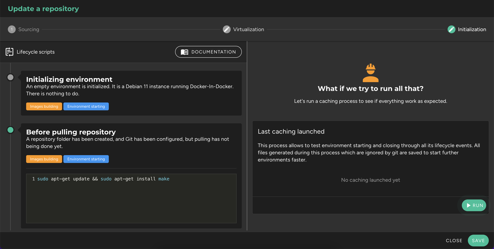

Once virtualization is managed for a Git repository, it is possible to input a set of commands to initialize it within an environment.

## Lifecycle Events

Each environment has a lifecycle, meaning events that govern its existence, where commands can be input to be executed. This can include adding dependencies to the environment (e.g., installing make), duplicating `.dist` files, creating variables, installing dependencies within containers, and automating any operation needed to make the environment usable once started.

These lifecycle events are managed within each repository, in the editing modal, under the **"Initialization"** tab, in the left section **"Lifecycle Scripts"**. They are sorted in chronological order:

| Event                          | Administrable | Description | Example |
| ------------------------------ | ------------- | ----------- | ------- |
| Initializing environment     | No            | An empty environment is initialized. No action needed. | |
| Before pulling repository        | Yes           | A folder for the repository has been created, and Git has been configured, but the sources haven't been retrieved yet. | Install make: `sudo apt-get update -y && sudo apt-get install make` |
| Pulling repository               | No            | Sources are being retrieved, and we are positioned on the default branch. No action needed. | |
| After pulling repository         | Yes           | Sources have been retrieved, but no docker-compose configuration has been generated. | Duplicate a .dist file: `cp .env.dist .env` |
| Before upping containers         | Yes           | A temporary docker-compose file has been created, and containers are about to be built. | Log in to a private registry: `docker login -u username -p password registry.company.ext` |
| Upping containers                | No            | Containers are being built. No action needed. | |
| After upping containers          | Yes           | All containers have been built. You can use docker-compose methods. | Install PHP dependencies with Composer: `docker-compose exec app composer install` |
| Before freezing environment    | Yes           | The environment is about to be paused. You can use docker-compose methods. | Backup database state to a dump: `docker-compose exec database bash -c "mysqldump -uroot -ppassword database > dump.sql"` |
| Before destroying environment    | Yes           | The environment is about to be permanently shut down. All containers will be destroyed. You can still use docker-compose methods. | Backup database state to a dump: `docker-compose exec database bash -c "mysqldump -uroot -ppassword database > dump.sql"` |

!!! **Environments can be started with the "_root_" or "_protocode_" user.** The latter is a non-privileged user, which has sudo access without a password for operations requiring super privileges. To install new dependencies with this user, for example, you will need to execute: `sudo apt-get install <package>`.

!!! **Commands will always be run from the root of the repository, with sh.** If you need them to be executed by a specific program (e.g., bash), you can place `#!/path/to/binary` at the top of your command (e.g., _#!/bin/bash_).

!! **The only restriction is not to input infinite commands**, such as launching JavaScript compilation with Webpack. This would block the process where the command was input, and it would eventually be stopped after 90 seconds of inactivity. This type of command should only be input inside a terminal once the environment is started.

## Caching

If initialization scripts have been added, it is likely to install dependencies (e.g., `"npm install"`) or download files. To speed up the environment startup, Protocode suggests running a caching process, which will start an environment, execute all initialization scripts, and save the non-versioned files that are generated. These will be injected when a new environment is opened.

