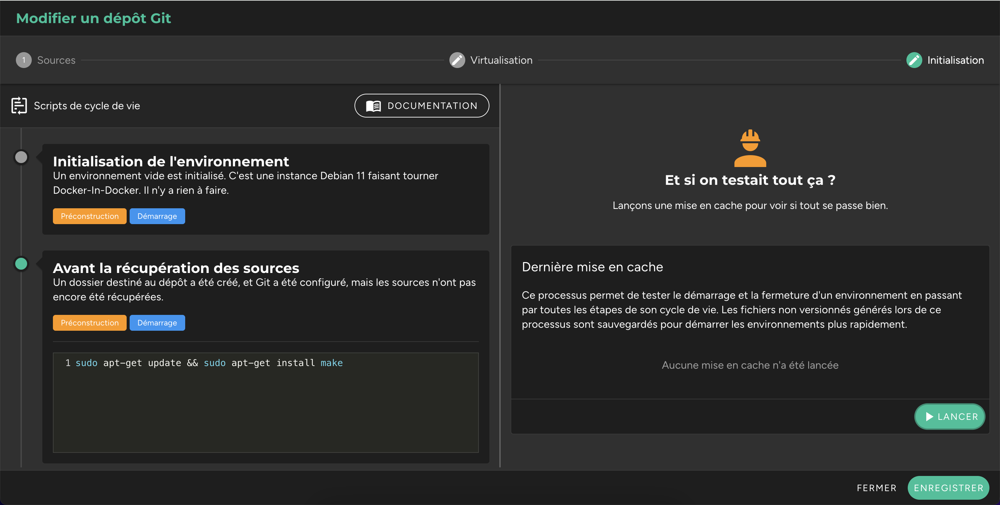

Une fois la virtualisation gérée pour un dépôt Git, il est possible de saisir un ensemble de commandes à lancer pour l'initialiser au sein d'un environnement.

## Événements du cycle de vie

Chaque environnement dispose d'un cycle de vie, autrement dit d'événements qui rythment son existence et sur lesquels il est possible de saisir des commandes à lancer. Cela peut être pour ajouter des dépendances au sein de l'environnement (ex : installer make), dupliquer des fichiers `.dist`, créer des variables, installer des dépendances au sein des conteneurs. En bref, automatiser toute opération nécessaire pour que l'environnement soit en état d'être utilisé une fois démarré.

Ces cycles de vie sont administrés sur chaque dépôt, dans la modale d'édition, onglet **"Initialisation"**, partie gauche **"Scripts de cycle de vie"**. Ils sont triés dans l'ordre chronologique :

| Événement | Administrable | Description | Exemple |
| ------------- | ---------------- | ------------- | ---------- |
| Initialisation de l'environnement | Non | Un environnement vide est initialisé. Il n'y a rien à faire. | |
| Avant la récupération des sources | Oui | Un dossier destiné au repository a été créé, et Git a été configuré, mais les sources n'ont pas encore été récupérées. | Installer make : `sudo apt-get update -y && sudo apt-get install make` |
| Récupération des sources | Non | Les sources sont en train d'être récupérées, et nous nous positionnerons sur la branche par défaut. Il n'y a rien à faire. | |
| Après la récupération des sources | Oui | Les sources ont été récupérées, mais aucune configuration docker-compose n'a été générée. | Dupliquer un fichier .dist : `cp .env.dist .env` | 
| Avant la construction des conteneurs | Oui | Un fichier docker-compose temporaire a été créé, et les conteneurs sont sur le point d'être construits. | Se connecter à un registry privé : `docker login -u username -p password registry.company.ext` |
| Construction des conteneurs | Non | Les conteneurs sont en cours de construction. Il n'y a rien à faire. | |
| Après la construction des conteneurs | Oui | Tous les conteneurs sont construits. Il est possible d'utiliser les méthodes de docker-compose. | Installer les dépendances PHP avec Composer : `docker-compose exec app composer install` |
| Avant la mise en pause des environnements | Oui | L'environnement est sur le point d'être mis en veille. Il est possible d'utiliser les méthodes de docker-compose. | Sauvegarder l'état de la base dans un dump : `docker-compose exec database bash -c "mysqldump -uroot -ppassword database > dump.sql"` |
| Avant la fermeture des environnements | Oui | L'environnement est sur le point d'être définitivement fermé. Tous les conteneurs vont être détruits. Il est encore possible d'utiliser les méthodes de docker-compose. | Sauvegarder l'état de la base dans un dump : `docker-compose exec database bash -c "mysqldump -uroot -ppassword database > dump.sql"` |

!!! **Les environnements peuvent être démarrés avec l'utilisateur "_root_" ou "_protocode_".** Le second est un utilisateur non privilégié, qui dispose d'accès sudo sans mot de passe afin d'effectuer des opérations nécessitant des super privilèges. Pour installer de nouvelles dépendances avec cet utilisateur par exemple, il vous faudra donc exécuter : `sudo apt-get install <package>`.

!!! **Les commandes seront toujours lancées depuis la racine du repository, avec sh.** Si vous avez besoin qu'elles soient exécutées par un programme particulier (comme bash), vous pouvez mettre tout en haut de votre commande un `#!/path/to/binary` (par exemple : _#!/bin/bash_).

!! **La seule contrainte est de ne pas saisir de commandes infinies**, comme lancer la compilation de fichiers JavaScript avec Webpack. Cela bloquerait le processus à l'endroit où la commande a été saisie, et il finirait par être arrêté au bout de 90 secondes d'inactivité. Ce type de commande ne doit être saisi qu'à l'intérieur d'un terminal une fois l'environnement démarré.

## Mise en cache

Si des scripts d'initialisation ont été ajoutés, il est probable que ce soit pour installer des dépendances (avec par exemple `"npm install"`) ou télécharger des fichiers. Pour gagner en célérité au démarrage d'un environnement, Protocode vous suggère de lancer une mise en cache, un processus qui va démarrer un environnement, exécuter tous les scripts d'initialisation et sauvegarder les fichiers non versionnés qui auront été générés. Ils seront réinjectés à l'ouverture d'un nouvel environnement.

