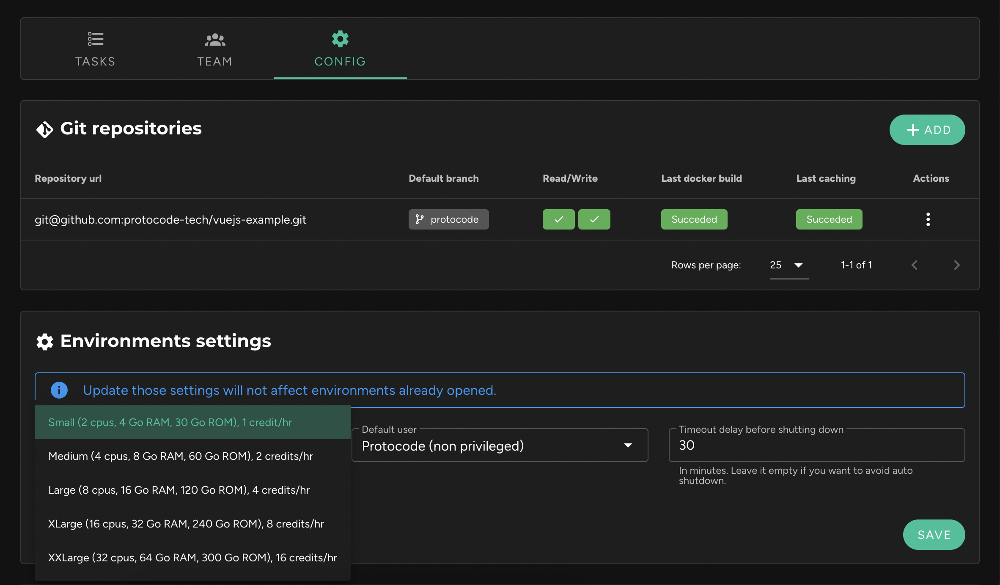

It is possible to choose the resources allocated to an environment based on its needs. This option is accessible from the project sheet, in the "Config" tab, within the "Environment Settings" block.

Here are the available resource profiles:

| Name     | CPU        | RAM     | Credits/hour | Default |
|----------|------------|---------|--------------|---------|
| Small    | 2 cores    | 4 GB    | 1 credit/hour| Yes     |
| Medium   | 4 cores    | 8 GB    | 2 credits/hour| No     |
| Large    | 8 cores    | 16 GB   | 4 credits/hour| No     |
| XLarge   | 16 cores   | 32 GB   | 8 credits/hour| No     |
| XXLarge  | 32 cores   | 64 GB   | 16 credits/hour| No     |

!!! Any modification of the allocated resources will not affect the environments that are already open, but only those that are opened later or restarted. If necessary, pause your environments and restart them.
