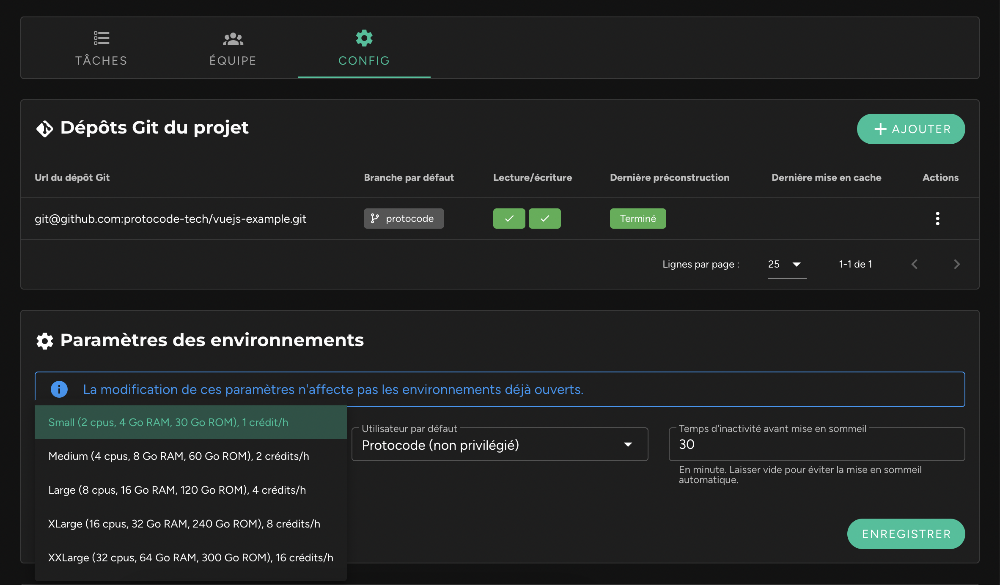

Il est possible de choisir les ressources à allouer à un environnement en fonction de ses besoins. Cette option est accessible dans la fiche d’un projet, dans l’onglet "Config", à l’intérieur du bloc "Paramètres des environnements".

Voici les différents profils de ressources disponibles :

| Nom      | CPU        | RAM     | Crédits/h | Par défaut |
|----------|-----------|---------|-----------|------------|
| Small    | 2 cœurs   | 4 Go    | 1 crédit/h | Oui        |
| Medium   | 4 cœurs   | 8 Go    | 2 crédits/h | Non        |
| Large    | 8 cœurs   | 16 Go   | 4 crédits/h | Non        |
| XLarge   | 16 cœurs  | 32 Go   | 8 crédits/h | Non        |
| XXLarge  | 32 cœurs  | 64 Go   | 16 crédits/h | Non        |

!!! Toute modification des ressources allouées n'affectera pas les environnements déjà ouverts, mais uniquement ceux ouverts ultérieurement ou remis en marche. Si nécessaire, mettez vos environnements en pause et redémarrez-les.
