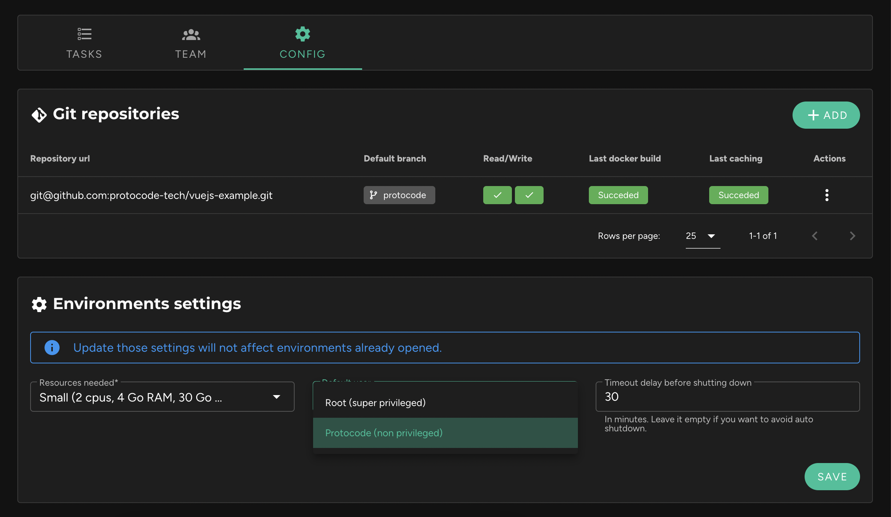

It is possible to choose the default user within the environment. This option is available in the project sheet, in the "Config" tab, within the "Environment Settings" block.

The options available are:
* **Root**: The super privileged user.
* **Protocode** (default): A non-privileged user. However, it has sudo access without a password for performing operations that require super privileges.

!!! Changing this setting only affects newly created environments. It does not affect environments that are already open or those that have been restarted.
