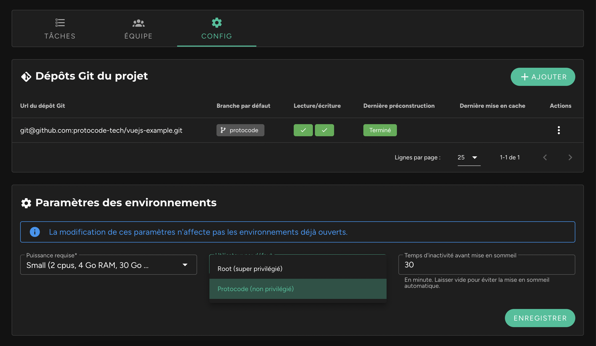

Il est possible de choisir l'utilisateur par défaut au sein de l'environnement. Cette option est disponible dans la fiche d’un projet, dans l’onglet "Config", au sein du bloc "Paramètres des environnements".

Il peut s'agir de :
* **Root** : l'utilisateur super privilégié.
* **Protocode** (par défaut) : un utilisateur non privilégié. Cependant, il dispose d’un accès sudo sans mot de passe afin de faire des opérations nécessitant des super privilèges.

!!! La modification de ce paramètre n’affecte que les environnements nouvellement créés. Elle n’affecte ni les environnements déjà ouverts, ni ceux remis en marche.
