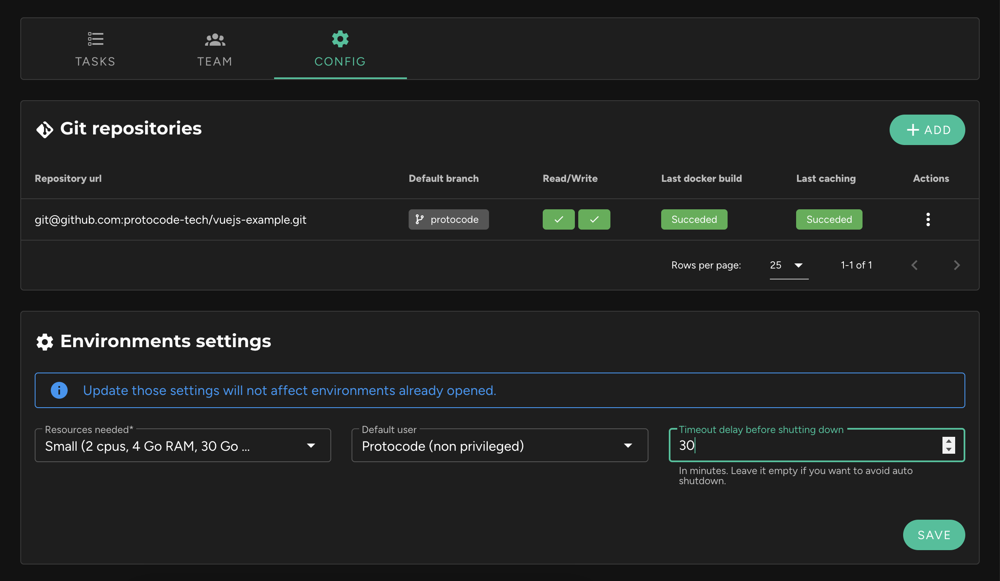

### Automatic Trigger

It is possible to manage the inactivity time after which an environment will automatically be paused. This option is available in the project sheet, in the "Config" tab, within the "Environment Settings" block.

**By default, this value is set to 30 minutes**. If you wish to disable this auto-pause, clear the field and click "Save".

!!! An environment is considered **inactive** if it has **no active ssh and http connections**. If an environment does not go to sleep, it is either because an IDE is still connected or someone is browsing a preview URL.

!!! Any change in the inactivity time before sleep will not affect already opened environments but only those opened afterward or restarted environments.

### Manual Trigger

It is also possible to manually trigger the pause at any time directly within a task:

### Effects

Pausing will save all data in the `/var/environment` directory and delete the environment. It will also stop the billing for the environment.

Restarting the environment will restore the data in the `/var/environment` directory and then restart the containers for each sub-project.

!! It is important to note that volumes declared in the docker-compose files will not be saved if they do not point to a directory inside `/var/environment`.
