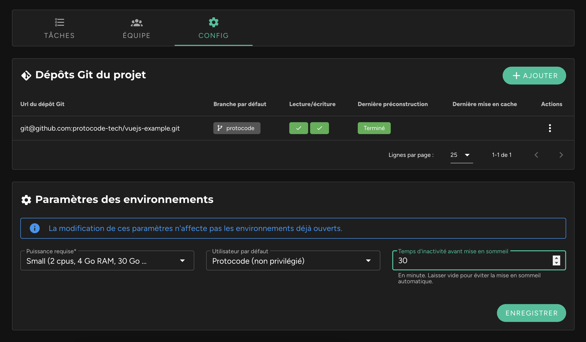

## Déclenchement automatique

Il est possible de gérer le temps d'inactivité au-delà duquel un environnement sera automatiquement mis en pause. Cette option est disponible dans la fiche d’un projet, dans l’onglet "Config", au sein du bloc "Paramètres des environnements".

**Par défaut, cette valeur est paramétrée sur 30 minutes**. Si vous souhaitez désactiver cette mise en pause, videz le champ et cliquez sur "Enregistrer".

!!! Est considéré comme **inactif** un environnement qui ne dispose d'**aucune connexion ssh et http active**. Si un environnement ne se met pas en veille, c’est soit parce qu'un IDE y est toujours connecté, ou que quelqu’un consulte une URL de prévisualisation.

!!! Toute modification du temps d'inactivité avant mise en sommeil n’affectera pas les environnements déjà ouverts, mais uniquement les environnements ouverts postérieurement, et les environnements remis en marche.

## Déclenchement manuel

Il est aussi possible de déclencher la mise en pause manuellement à tout moment directement dans une tâche :

## Effets

La mise en sommeil aura pour effet de sauvegarder toutes les données se trouvant dans le répertoire `/var/environment`, et de supprimer l’environnement. Elle aura aussi pour effet d’arrêter la facturation de l’environnement.

La remise en marche de l’environnement viendra quant à elle remettre les données au sein du répertoire `/var/environment`, puis redémarrera les conteneurs de chaque sous-projet.

!! Il est important de noter que les volumes déclarés dans les fichiers docker-compose ne seront pas sauvegardés s’ils ne pointent pas un répertoire se trouvant dans `/var/environment`.
