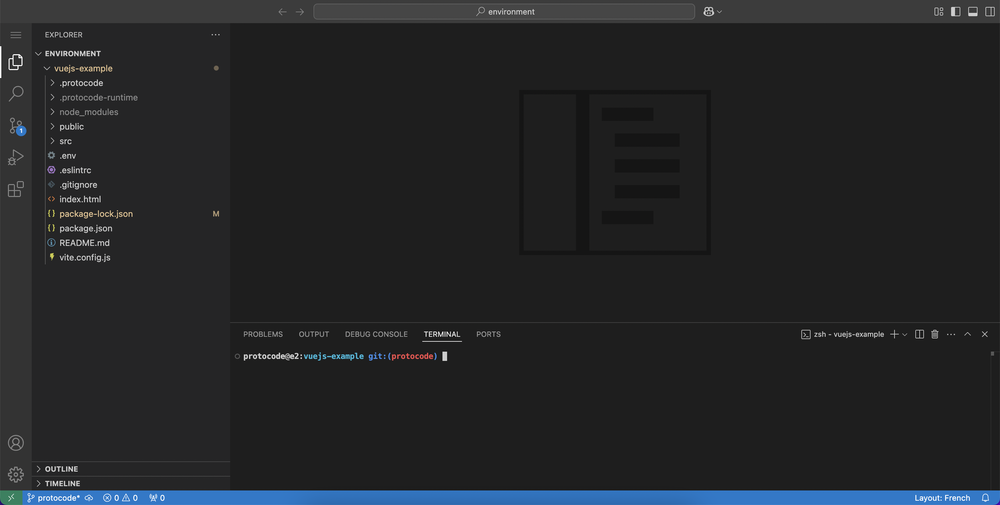

Dans Protocode, pour chaque environnement démarré, il existe différentes interfaces web qui vous permettent soit de coder, soit de tester.

## IDE Web

Cette interface est fixe et existe toujours. Il s'agit d'une version portabilisée de Visual Studio Code. Il est possible d'y accéder depuis le menu contextuel "Coder" d'une tâche, et en cliquant sur "Ouvrir l'IDE web".

Cette implémentation web de Visual Studio Code offre les mêmes possibilités que la version logicielle. Il est possible d'y ajouter les mêmes extensions, d'ouvrir des terminaux, d'y télécharger des fichiers. En bref, d'y faire tout ce que l'on fait en local, mais au travers de votre navigateur.

C'est très pratique pour intervenir rapidement sur de la revue de code, ou pour permettre à d'autres développeurs de venir vous aider à déboguer un problème (en leur fournissant l'URL de l'interface).

## Les URLs de prévisualisation

En fonction du paramétrage saisi dans la partie [Virtualisation](/configurer-son-projet/routing-conteneurs) de chaque dépôt, certains conteneurs sont exposés. Protocode recense tous ces conteneurs, et liste les URLs de prévisualisation associées. Celles-ci se trouvent dans le menu contextuel de chaque assignation.

!!! Bien que ces URLs soient présentes dans le menu, cela ne veut pas pour autant dire que l'application associée soit en fonctionnement. Notamment, pour des applications JavaScript par exemple, où il faudra préalablement se connecter à l'environnement, et lancer la compilation depuis le conteneur Node.

Ces URLs de prévisualisation permettent tant au développeur qu'au superviseur de la tâche de venir tester l'exécution du code produit, sans qu'il soit nécessaire de faire un déploiement. C'est aussi un outil très pratique lorsque l'on développe une application qui communique de manière bilatérale avec des outils tiers (tels que les services de paiement en ligne), souvent au travers de webhooks.

## Liens de prévisualisation persistants

À droite de chaque lien, vous disposez d'un bouton "Lien persistant" qui vous permet d'obtenir une URL publique qui réouvre automatiquement l'environnement s'il est fermé ou en pause. Vous pouvez ainsi communiquer à un testeur une URL qui lui permet de consulter le rendu à sa guise, sans action de votre part et sans inscription requise.
