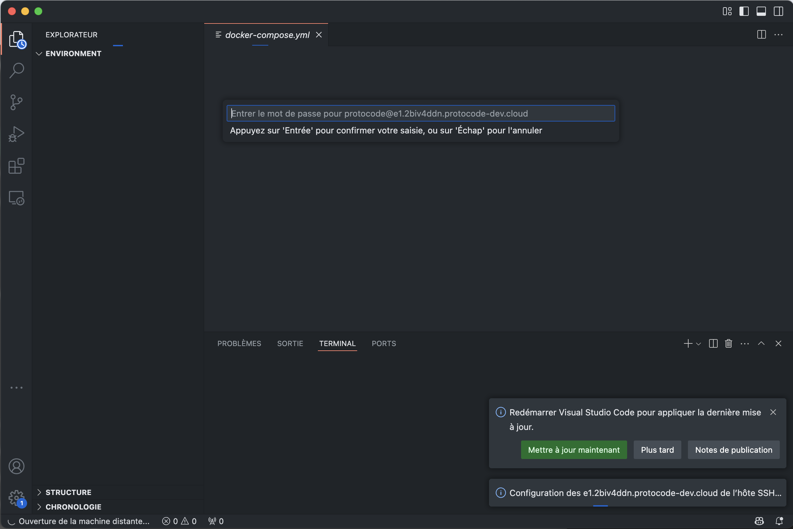
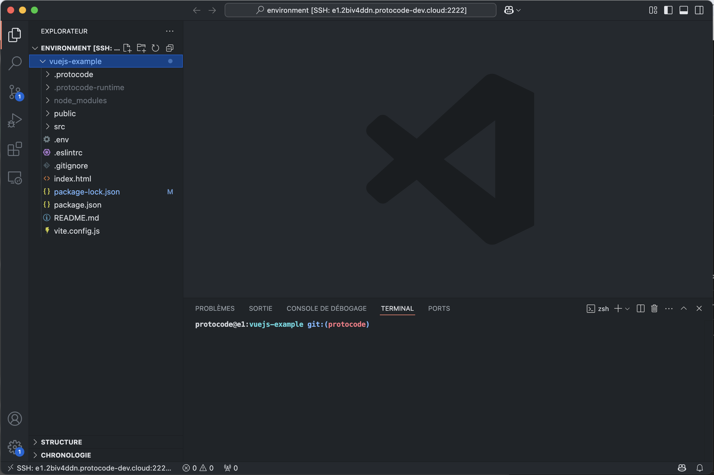

In the "Code" context menu of a task, you have a button that allows you to "Open in VSCode."

This button will directly open the [Remote - SSH](https://marketplace.visualstudio.com/items?itemName=ms-vscode-remote.remote-ssh) extension in your local VSCode. If the extension is not already installed, VSCode will prompt you to install it.

Next, if you haven't [added a personal SSH key](/connect-and-customize/add-ssh-keys), VSCode will ask you for the environment's password (which can be copied from a modal that appears when you click on "Open in VSCode" if no SSH key is associated with your account):

Finally, VSCode connects to the environment via an SSH connection and offers all the native capabilities (viewing, modifying files, opening terminals, running commands) as if the project were installed on your machine.

