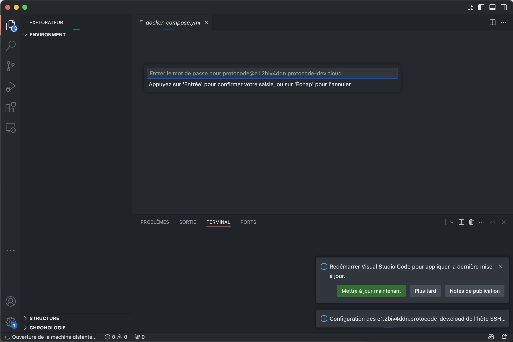
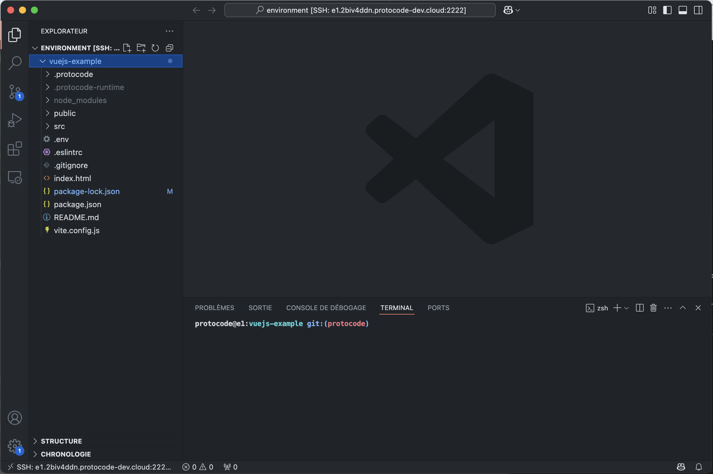

Dans le menu contextuel "Coder" d'une tâche, vous disposez d'un bouton proposant d'"Ouvrir dans VSCode".

Ce bouton ouvrira directement l'extension [Remote - SSH](https://marketplace.visualstudio.com/items?itemName=ms-vscode-remote.remote-ssh) de votre VSCode local. Si l'extension n'est pas déjà installée, VSCode vous proposera de l'installer.

Ensuite, si vous n'avez pas [renseigné de clé SSH personnelle](/connecter-ses-outils/ajouter-cles-ssh), VSCode vous demandera le mot de passe de l'environnement (copiable dans une modale qui s'ouvre au clic sur "Ouvrir dans VSCode" quand aucune clé SSH n'est associée au compte) :

Enfin, VSCode se connecte à l'environnement via une connexion SSH et offre toutes les possibilités natives (afficher, modifier des fichiers, ouvrir des terminaux, lancer des commandes) comme si le projet était installé sur votre machine.

