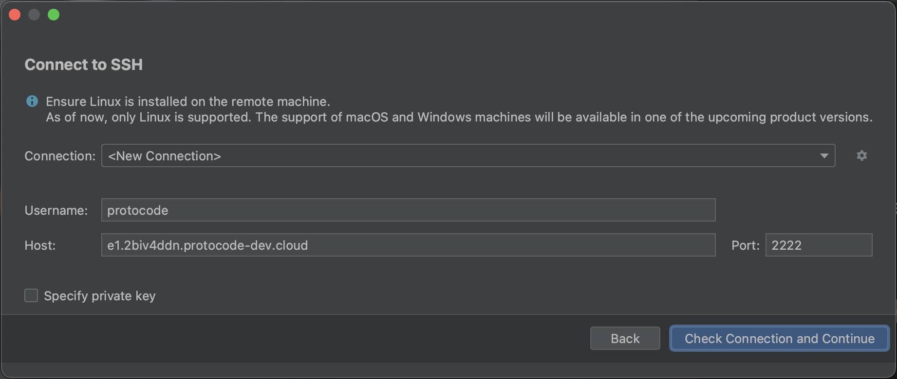
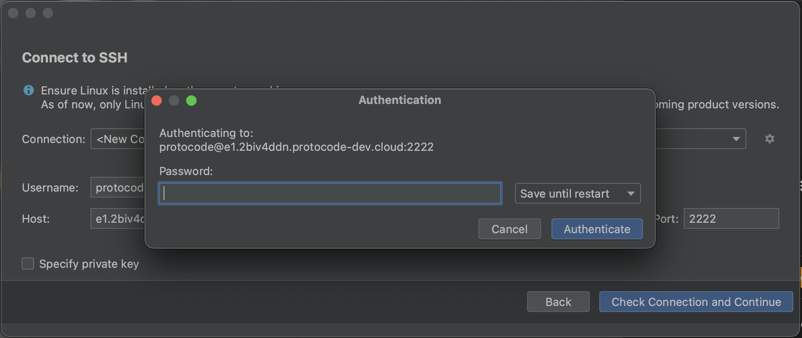
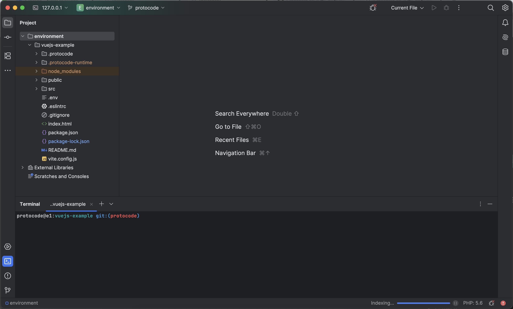

In the "Code" context menu of an assignment, you can connect an environment to one of the following 8 JetBrains IDEs:

* CLion
* GoLand
* IntelliJ
* PhpStorm
* PyCharm
* Rider
* RubyMine
* WebStorm

### **Prerequisites**

First, you must **install the [JetBrains Gateway](https://www.jetbrains.com/fr-fr/remote-development/gateway/)** utility.

Additionally, **the environment must have at least "Medium" resources (4 CPUs, 8 GB of RAM)**. You can manage resource allocation in the project details under the "Config" tab within the "Environment Settings" block. Changing the resources will not affect environments that are already open. If needed, pause and restart them to apply the new allocation.

### **Opening an IDE**

When you click on one of the JetBrains IDEs, a modal will appear to indicate that the selected IDE is being installed. This process usually takes less than a minute. Then, a JetBrains Gateway window will open to confirm the SSH connection details. Click on "Check connection and Continue."

Next, if you haven't [added a personal SSH key](/connect-and-customize/add-ssh-keys), JetBrains Gateway will request the environment's password (which can be copied from a modal that appears when you click "Open in ..." if no SSH key is associated with your account). Paste the password and click "Authenticate."

Finally, the IDE will open and provide full native capabilities (viewing, modifying files, opening terminals, running commands) as if the project were installed on your machine.

