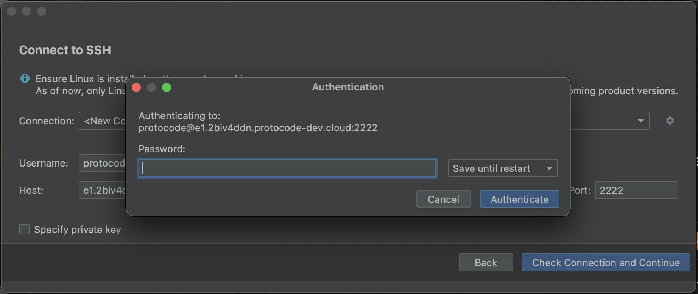

Dans le menu contextuel "Coder" d'une assignation, il est possible de connecter un environnement avec l'un des 8 IDEs de JetBrains suivants :

* CLion
* GoLand
* IntelliJ
* PhpStorm
* PyCharm
* Rider
* RubyMine
* WebStorm

## Prérequis

Tout d'abord, il est indispensable d'**installer préalablement l'utilitaire [JetBrains Gateway](https://www.jetbrains.com/fr-fr/remote-development/gateway/)**.

Ensuite, **les ressources allouées à l'environnement doivent à minima être "Medium" (4 CPUs, 8 Go de RAM)**. L'allocation de ressources se gère dans la fiche d'un projet, sous l'onglet "Config", au sein du bloc "Paramètres des environnements". La modification des ressources n'affectera pas les environnements déjà ouverts. Si besoin, mettez-les en pause et remettez-les en marche pour appliquer la nouvelle allocation.

## Ouverture d'un IDE

Au clic sur l'un des IDEs de la suite, une modale s'ouvre pour afficher que l'IDE sélectionné est en cours d'installation. Cela prend généralement moins d'une minute. Ensuite, une fenêtre de JetBrains Gateway s'ouvre pour confirmer les éléments de la connexion SSH. Cliquez sur "Check connection and Continue".

Ensuite, si vous n'avez pas [renseigné de clé SSH personnelle](/connecter-ses-outils/ajouter-cles-ssh), JetBrains Gateway vous demandera le mot de passe de l'environnement (copiable dans une modale qui s'ouvre au clic sur "Ouvrir dans ..." quand aucune clé SSH n'est associée au compte). Collez le mot de passe et cliquez sur "Authenticate".

Enfin, l'IDE s'ouvre et offre toutes les possibilités natives (afficher, modifier des fichiers, ouvrir des terminaux, lancer des commandes) comme si le projet était installé sur votre machine.

