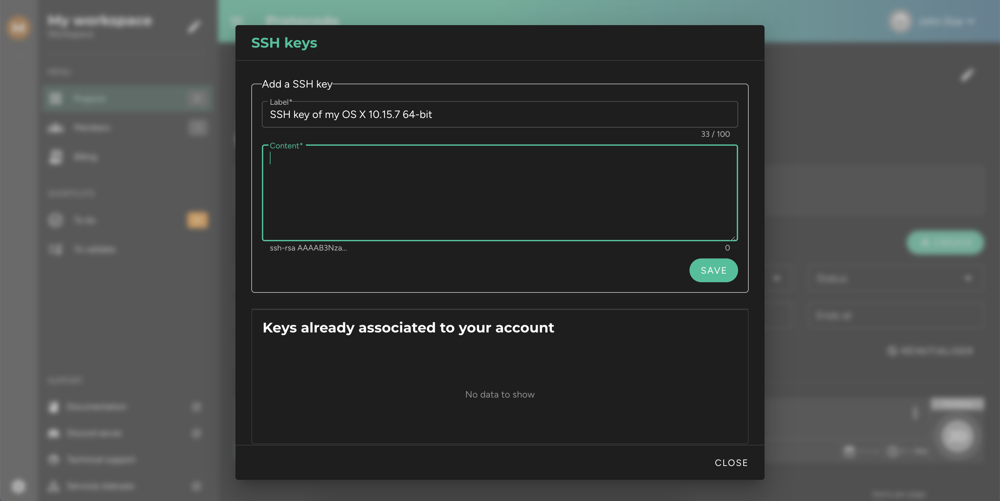

Each time you want to connect to an environment via your terminal or IDE, if you haven't provided Protocode with a personal SSH key, you will be asked for a password. You can copy it from the Protocode interface within a modal. This password was randomly generated when the environment was started.

### **Add a New SSH Key**

If you don’t want to provide a password every time you connect to an environment via SSH, you have the option to save one or more SSH keys. To do this, go to the navigation bar at the top, click on the context menu, and then click on **"SSH Keys"**.

A modal will open, allowing you to enter a new key in a form. Below this form, you'll see all the keys you’ve already registered.

### **Generate a New SSH Key**

If you haven't generated an SSH key on your machine yet, you will need to do so first.

! If you're working on **Windows**, you must first **check that the OpenSSH application is installed**.

If you're on Linux or Mac, open your terminal and run:

[prism classes="language-bash"]
ssh-keygen -t rsa -b 4096 -C "firstname.lastname@provider.ext"
[/prism]

In this command, replace _firstname.lastname@provider.ext_ with your email address.

Once the key is generated, display it in your terminal by running:

[prism classes="language-bash"]
cat ~/.ssh/id_rsa.pub 
[/prism]

Now, simply copy the key and paste it into the SSH key addition form in the modal.
