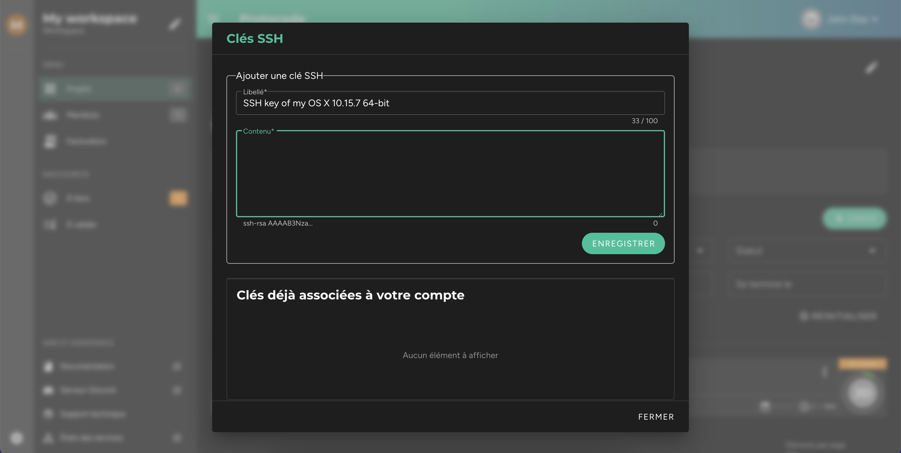

Chaque fois que vous souhaiterez vous connecter à un environnement avec votre terminal ou votre IDE, si vous n'avez pas fourni à Protocode de clé SSH personnelle, il vous sera demandé de fournir un mot de passe. Il vous sera proposé de le copier depuis l'interface de Protocode dans une modale. Ce dernier a été généré aléatoirement lors de l'ouverture de l'environnement.

## Ajout d'une nouvelle clé SSH

Si vous ne souhaitez pas avoir à fournir de mot de passe chaque fois que vous vous connectez à un environnement en SSH, vous avez la possibilité d'enregistrer une (ou plusieurs) clés SSH. Pour cela, il vous faut aller dans la barre de navigation en haut, cliquer dans le menu contextuel, puis cliquer sur "Clés SSH".

Une modale s'ouvre, et vous offre la possibilité d'entrer une nouvelle clé dans un formulaire. En dessous de celui-ci se trouvent toutes les clés que vous avez déjà enregistrées.

## Générer une nouvelle clé SSH

Si vous n'avez encore jamais généré de clé SSH sur votre poste, il va falloir le faire préalablement.

! Si vous travaillez sur **Windows**, il vous faudra tout d'abord **vérifier que l'application OpenSSH est installée**.

Si vous travaillez sur Linux ou Mac, entrez directement dans votre terminal :

[prism classes="language-bash"]
ssh-keygen -t rsa -b 4096 -C "firstname.lastname@provider.ext"
[/prism]

Dans cette commande, il vous faut bien évidemment remplacer _firstname.lastname@provider.ext_ par votre adresse email.

Une fois la clé générée, affichez-la dans votre terminal en lançant :

[prism classes="language-bash"]
cat ~/.ssh/id_rsa.pub 
[/prism]

Il ne vous reste plus qu'à la copier et à la coller dans le formulaire de la modale d'ajout de clé SSH.
