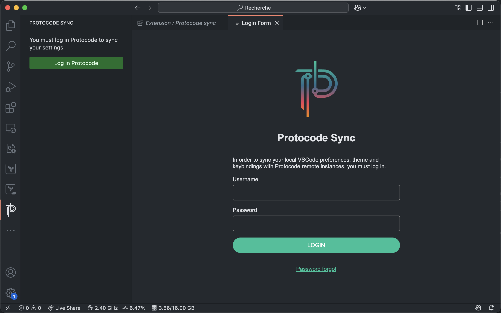

`FONCTIONNALITÉ EN BÊTA`

Afin que vous puissiez continuer de travailler sans changer vos habitudes, nous avons développé une extension pour Visual Studio Code nommée [Protocode Sync](https://marketplace.visualstudio.com/items?itemName=Protocode.protocode-vscode-extension) permettant de récupérer vos thèmes, préférences, raccourcis clavier et alias de terminal locaux afin de les synchroniser avec les environnements ouverts sur Protocode.

Une fois l'extension installée, celle-ci ajoute une entrée "Protocode Sync" dans le panneau latéral gauche de VSCode. Au clic, vous serez invité à vous authentifier.

Une fois authentifié, elle procède à la synchronisation automatique de thèmes, préférences, raccourcis clavier et alias de terminal.
