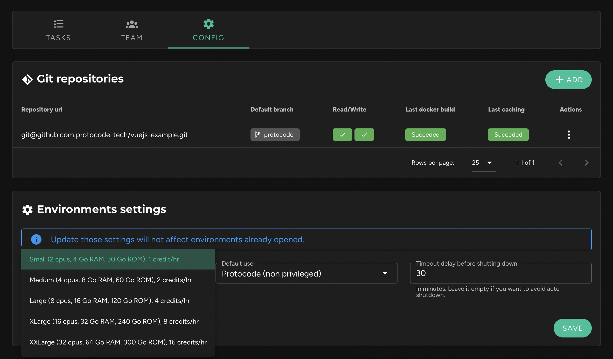

After some time of use, the environment seems to suffer from slowdowns, processes are sluggish, and page rendering is slower than usual.

It is likely that **the resources allocated to the environment are not properly sized**. By default, the minimum is allocated (2 CPUs, 4 GB of RAM), but it is possible to assign much larger resources (up to 32 CPUs, 64 GB of RAM). To do this, go to the project's page, in the "Config" tab, then in "Environment Settings," modify the value of the "required power," and click "Save."

You will then need to pause your environment and restart it for the new resources to be allocated.

If the problem persists, [contact support](/resources-and-support/contact-support).
