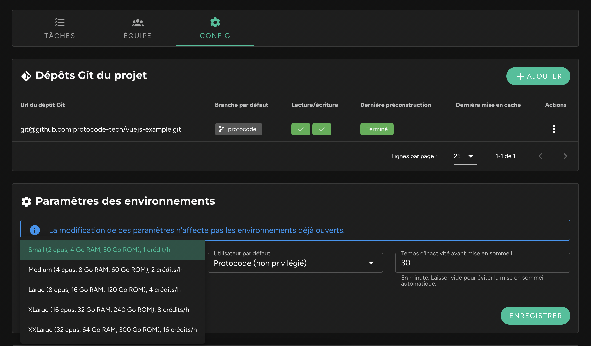

Après quelques temps d'utilisation, l'environnement semble souffrir de ralentissements, les processus lancés sont poussifs, le rendu des pages plus long qu'à l'ordinaire.

Il est probable que **les ressources allouées à l'environnement ne soient pas bien dimensionnées**. De base, le minimum est affecté (2 cpus, 4 Go de Ram), mais il est possible d'affecter des ressources bien plus grandes (jusqu'à 32 cpus, 64 Go de Ram). Pour cela, rendez vous dans la fiche d'un projet, onglet "Config", puis dans "Paramètres des environnements" modifiez la valeur de la "puissance requise", puis cliquez sur "Enregistrer".

Il vous faudra ensuite mettre en pause votre environnement, puis le remettre en marche afin que les nouvelles ressources lui soient affectées.

Si le problème persiste, [contactez le support](/ressources-support/contact-support).